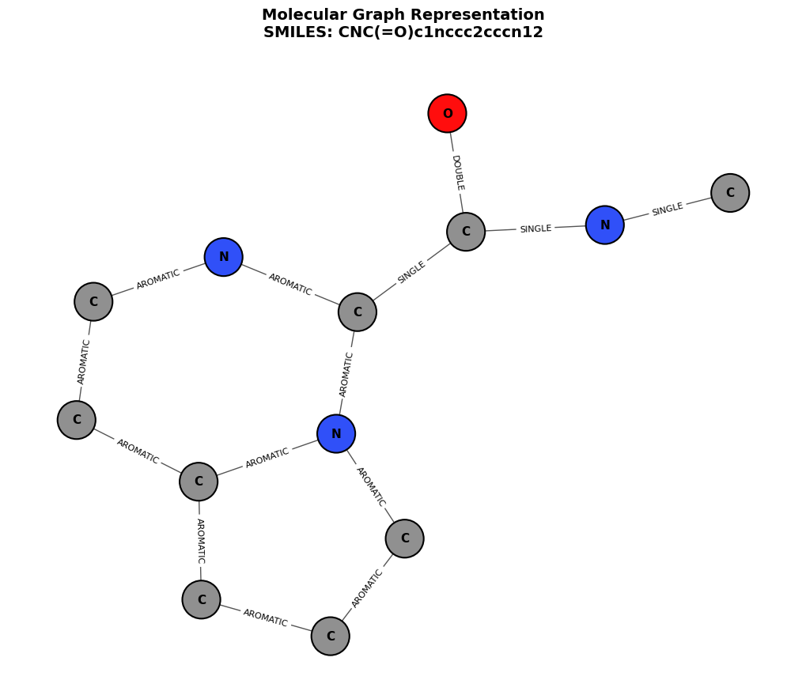

# 🧪 Chemical Graph Series

A progressive educational journey from basic **cheminformatics** to state-of-the-art **Graph Neural Networks (GNNs)** and **Molecular Transformers**. This series covers everything from representing molecules as graphs to predicting chemical properties using advanced deep learning architectures.



## 🚀 Curriculum Overview

The course is structured into sequential notebooks, moving from foundations to advanced modeling.

| Lesson | Title | Key Concepts |
| :--- | :--- | :--- |
| **01** | [Building Graphs](./notebooks/01_Building_Graphs.ipynb) | SMILES, RDKit, Mol-to-Graph, Featurization |
| **02** | [Positional Encoding](./notebooks/02_Positional_Encoding.ipynb) | Laplacian Eigenvectors, RWPE, Spectral Analysis |
| **03** | [GAT Model](./notebooks/03_GAT_Model.ipynb) | Graph Attention Networks, Message Passing |
| **04** | [Sparse Attention](./notebooks/04_Sparse%20Attention.ipynb) | Efficiency in Graph Transformers, Locality |
| **05** | [Full Graph Transformer](./notebooks/05_Full_Graph_Transformer.ipynb) | Global Attention, Edge Features, Positional Embeddings |
| **06** | [Advanced Graph Models](./notebooks/06_Advanced_Graph_Models.ipynb) | GraphGPS, Hybrid Architectures, Equivariance |
| **07** | [Modelling & Predictions](./notebooks/07_Modelling_and_Predictions.ipynb) | Property Prediction (ESOL, FreeSolv), Training Loops |

## 🛠️ Setup & Installation

This project uses `pyproject.toml` for dependency management. It is recommended to use [uv](https://github.com/astral-sh/uv) or a standard virtual environment.

### Using `uv` (Recommended)
```bash
# Sync environment and install dependencies
uv sync
```

### Using `pip`
```bash
pip install rdkit torch torch-geometric networkx matplotlib pandas jupyter py3dmol scipy
```

## 📂 Project Structure

*   `notebooks/`: Interactive Jupyter lessons containing explanations and code.
*   `molGraph.png`: Visual representation of a chemical graph used in documentation.
*   `pyproject.toml`: Project metadata and dependency definitions.

## 🧪 Requirements

*   **Python**: >= 3.13
*   **Core Libraries**: RDKit, PyTorch Geometric, NetworkX, Matplotlib
